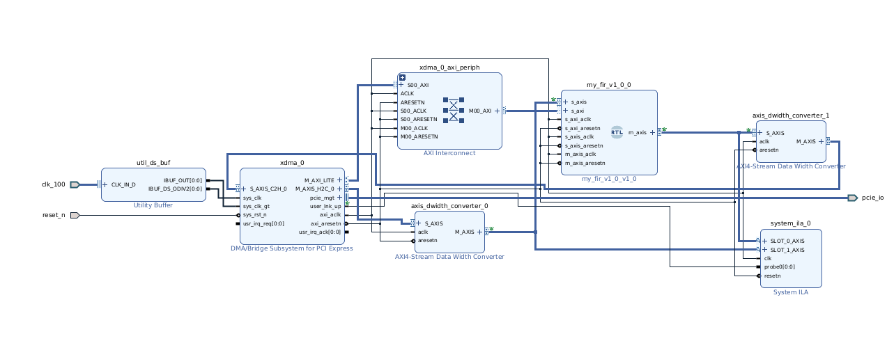
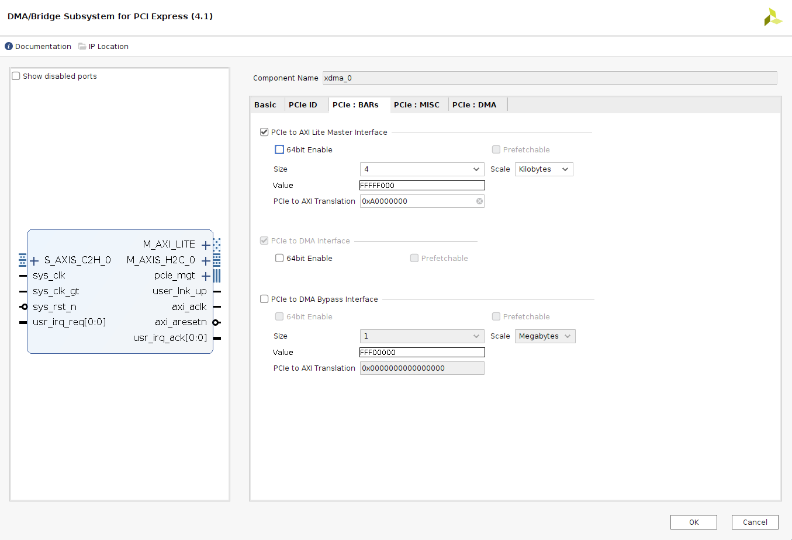
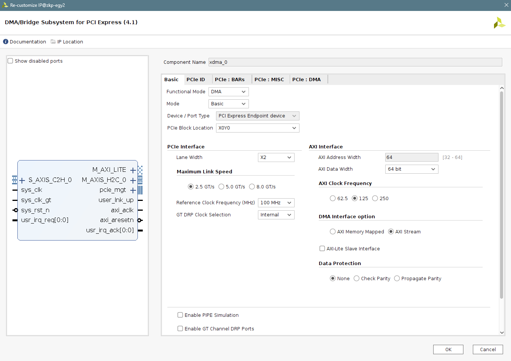
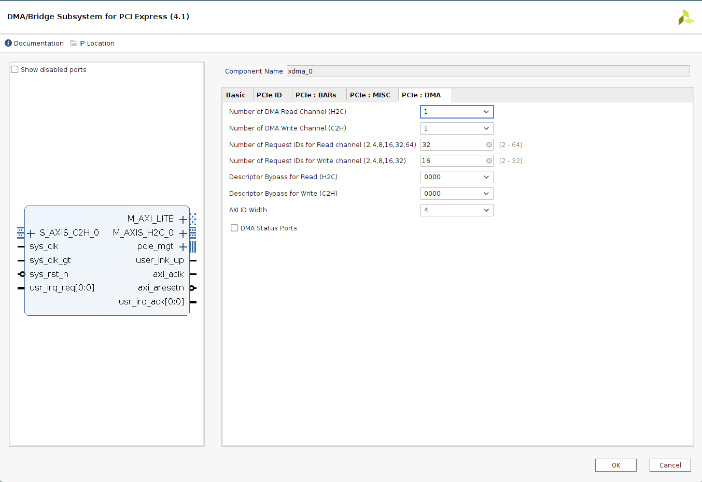
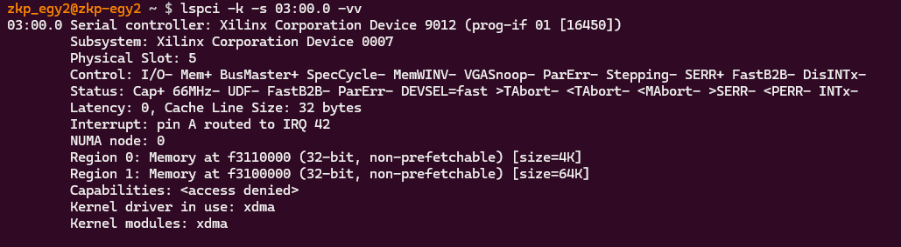

# xilinx_xdma_demo Tutorial

This repository is a step-by-step XDMA + custom IP integration example.
The goal is to move data from a Linux host to FPGA fabric through PCIe, process it in a custom FIR AXI-Stream block, and return data back to the host.

## 1) What Is XDMA, and Why Use It?

**XDMA** (Xilinx DMA for PCIe) is a Xilinx IP + software driver flow that gives high-throughput host <-> FPGA transfers over PCIe.

Why XDMA is useful in this project:

- It provides a standard, reusable PCIe data path instead of writing a custom PCIe endpoint and software stack.
- It exposes convenient Linux device nodes for data movement and register access.
- It fits streaming accelerators well: host sends samples (H2C), FPGA processes, host reads results (C2H).
- It lets us focus on accelerator integration and system bring-up instead of PCIe low-level details.

In this demo, XDMA is the bridge between host software and the FIR hardware in programmable logic.

## 2) Hardware Overview (FIR + Vivado Block Design)

The hardware design includes:

- Xilinx XDMA IP (PCIe endpoint and DMA engine)
- Custom FIR IP (`my_fir_v1_0`)
- AXI interconnect and width converters as needed
- AXI-Lite path for FIR register/coefficient programming
- AXI-Stream path for sample input/output

Top-level block design:



### FIR Notes

- FIR architecture is transposed/pipelined for streaming operation.
- Current implementation uses **5 taps**.
- FIR supports:
  - AXI-Stream Slave (`S_AXIS`) input
  - AXI-Stream Master (`M_AXIS`) output
  - AXI-Lite Slave (`S_AXI`) control/coefficients

### Addressing and Register Access

The host writes FIR configuration through XDMA user BAR mapped AXI-Lite space.
Use the address translation figure while matching the Vivado Address Editor assignment:



## 3) Vivado XDMA Configuration

When creating or reviewing the design in Vivado, verify these areas:

1. PCIe link/device setup for your target board.
2. XDMA channel directions used by the design:
   - H2C for host-to-FPGA streaming input
   - C2H for FPGA-to-host streaming output
3. AXI memory-mapped path for register/control access.
4. AXI-Stream data width compatibility between XDMA and FIR (via converters if required).

Reference screenshots:





Project recreation/build artifacts are under `vivado/`:

- `vivado/recreate_project.tcl`
- `vivado/bd_design.tcl`
- `vivado/xdma_demo.xpr`

## 4) Xilinx XDMA Software (Linux Side)

This repo includes Xilinx Linux driver references under:

- `testing/XDMA_drivers/dma_ip_drivers/`
- `testing/XDMA_drivers/XilinxAR65444/`

Useful included resources:

- Xilinx DMA IP driver documentation landing page (from local README)
- AR65444 Linux package and helper install script

Example install flow (from `build-install-driver-linux.sh`):

```bash
cd testing/XDMA_drivers/XilinxAR65444/Linux
sudo ./build-install-driver-linux.sh
```

The script builds the driver/tests, installs `xdma.ko`, updates module loading, and runs `modprobe xdma`.

After loading the driver, verify PCIe enumeration and XDMA presence:



### 4a) Low-Level Command Reference

After the XDMA driver and test tools are built, use these commands to interact with the FIR hardware:

**Read AXI-Lite Registers:**

```bash
TESTS_BIN=/mnt/d_drive/Digital_Electronics/XDMA/xilinx_xdma_demo/testing/XDMA_drivers/dma_ip_drivers/XDMA/linux-kernel/tools
sudo $TESTS_BIN/reg_rw /dev/xdma0_user <address> r
```

Example (read Tap 1 at offset 0x4):
```bash
sudo $TESTS_BIN/reg_rw /dev/xdma0_user 0x4 r
```

**Write AXI-Lite Registers:**

```bash
sudo $TESTS_BIN/reg_rw /dev/xdma0_user <address> w <value>
```

Example (write 0x1234 to Tap 1):
```bash
sudo $TESTS_BIN/reg_rw /dev/xdma0_user 0x4 w 0x1234
```

**FIR AXI-Lite Register Map** (BAR-relative addresses):
- `0x0`: Control register (write 0x1 to enable filter)
- `0x4`: Tap 1 coefficient
- `0x8`: Tap 2 coefficient
- `0xc`: Tap 3 coefficient
- `0x10`: Tap 4 coefficient
- `0x14`: Tap 5 coefficient

**Send Streaming Data (Host → FPGA via H2C):**

```bash
sudo $TESTS_BIN/dma_to_device -d /dev/xdma0_h2c_0 -a 0x0 -s 1024 -c 1 -f input_signal.bin
```

Args:
- `-d <device>`: H2C device node
- `-a <addr>`: Transfer address (usually 0x0)
- `-s <size>`: Transfer size in bytes
- `-c <count>`: Number of transfers
- `-f <file>`: Input file path

**Receive Streaming Data (FPGA → Host via C2H):**

```bash
sudo $TESTS_BIN/dma_from_device -d /dev/xdma0_c2h_0 -a 0x0 -s 1024 -c 1 -f output_signal.bin
```

Args:
- `-d <device>`: C2H device node
- `-a <addr>`: Transfer address (usually 0x0)
- `-s <size>`: Transfer size in bytes
- `-c <count>`: Number of transfers
- `-f <file>`: Output file path

Typical runtime flow from user space:

1. Program FIR coefficients through AXI-Lite registers using `reg_rw`.
2. Write input sample buffer using H2C via `dma_to_device`.
3. Read output sample buffer using C2H via `dma_from_device`.
4. Compare input/output (or against a software reference when needed).

## 5) Simple Python Wrapper Scripts

Two ready-to-run scripts simplify the test workflow without CLI argument handling or parsing:

### 5a) Generate Counting Input Vectors

**Script:** `testing/python/count_generator.py`

Generate a counting pattern (0, 1, 2, ..., N-1) as a binary stream for testing:

```bash
cd testing/python
python3 count_generator.py input_signal.bin 256 0 1
```

Args:
- `input_signal.bin`: Output binary file
- `256`: Number of 16-bit samples
- `0`: Start value
- `1`: Step/increment per sample

Output: `input_signal.bin` (1024 bytes for 256 samples)

### 5b) Run the Full Integration Test

**Script:** `testing/python/smoke_runner_simple.py`

Automates the complete test flow with no CLI args—just reads from file, processes, and writes output.

**What it does:**
1. Validates input file (`input_signal.bin`)
2. Programs FIR tap coefficients via `reg_rw` (5 writes to registers 0x4, 0x8, 0xc, 0x10, 0x14)
3. Enables the filter via control register (0x0)
4. Spawns C2H capture thread (FPGA → Host)
5. Sends H2C data (Host → FPGA)
6. Waits for transfer completion
7. Verifies output file (`output_signal.bin`)

**Usage:**

```bash
cd testing/python
sudo python3 smoke_runner_simple.py
```

**Hardcoded Configuration:**
- Device nodes: `/dev/xdma0_user`, `/dev/xdma0_h2c_0`, `/dev/xdma0_c2h_0`
- FIR base address: `0xA0000000` (BAR-relative)
- Tap coefficients: `[1, 0, 0, 0, 0]` (pass-through)
- Input file: `input_signal.bin` (must exist in current directory)
- Output file: `output_signal.bin` (created in current directory)

**Full Workflow Example:**

```bash
# 1. Generate 256-sample counting input
cd /mnt/d_drive/Digital_Electronics/XDMA/xilinx_xdma_demo/testing/python
python3 count_generator.py input_signal.bin 256 0 1

# 2. Run smoke test (programs taps, sends/receives data)
sudo python3 smoke_runner_simple.py

# 3. Inspect output
hexdump -C input_signal.bin | head
hexdump -C output_signal.bin | head

# 4. (Optional) Verify tap programming by reading registers
TESTS_BIN=../XDMA_drivers/dma_ip_drivers/XDMA/linux-kernel/tools
sudo $TESTS_BIN/reg_rw /dev/xdma0_user 0x4 r
```

**Expected Behavior for Pass-Through Test:**

With tap coefficients `[1, 0, 0, 0, 0]`, the output should be input shifted by ~4 samples (pipeline latency), then match sample-by-sample afterward. The 4-sample offset is typical for a 5-tap transposed FIR filter startup.

## Repository Pointers

- RTL source: `src/`
- Vivado project/scripts: `vivado/`
- XDMA driver references: `testing/XDMA_drivers/`

